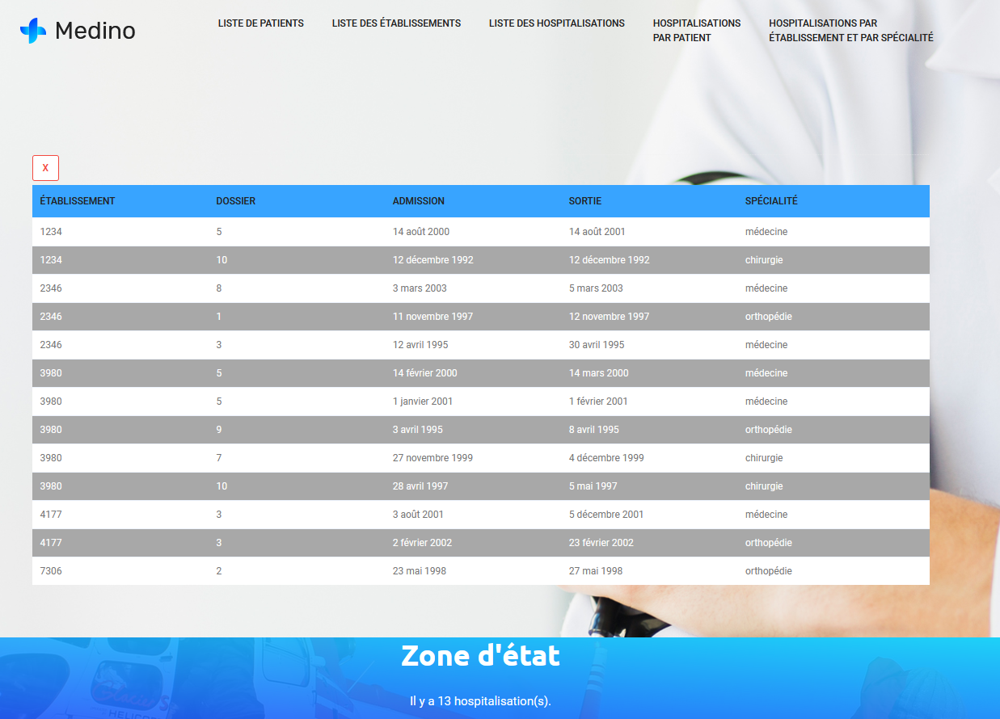

# JSON_dynamique
Page web développée pour le cours IFT1142, session Hiver 2020. Utilisation de la notation JSON pour
créer des tableaux contenant des informations sur des patients et des hôpitaux. Fonctions en Javascript
pour faire interagir les différents tableaux ensemble et affichage dynamique sur une page web unique à cinq onglets.
Accessoirement, implantation d'un modèle bootstrap (Colorlib) et première utilisation de branch sur github.

